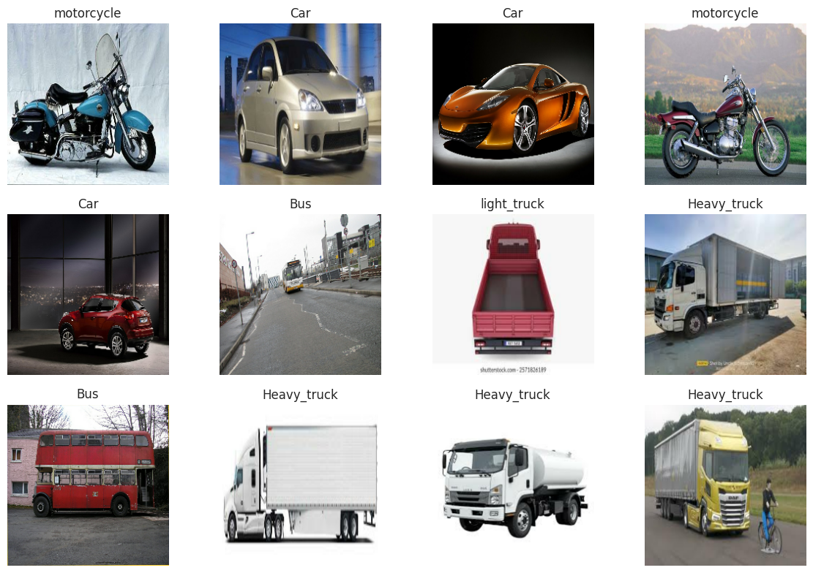
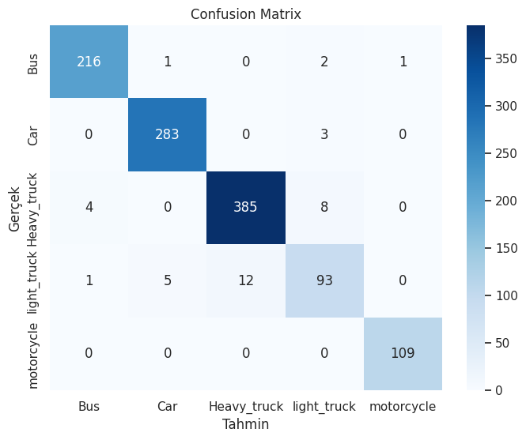

# Vehicle Image Classification with Transfer Learning

This project performs vehicle image classification using transfer learning with **EfficientNetB0**.  
The model is trained on a Kaggle vehicle dataset and enhanced with:

- data augmentation
- class balancing with class weights
- fine-tuning
- confusion matrix and classification report
- Grad-CAM for explainability
- single image inference

## Project Goal

The goal of this project is to classify vehicle images into predefined categories automatically using deep learning.

Example classes may include:
- Bus
- Car
- Motorcycle
- Light Truck
- Heavy Truck

## Dataset

Dataset source:
- Kaggle dataset: `zainab288/vehicle-weight-estimation-dataset-5-classes`

The dataset is downloaded programmatically using `kagglehub`.

## Technologies Used

- Python
- TensorFlow / Keras
- EfficientNetB0
- Scikit-learn
- Matplotlib
- Seaborn
- Pillow
- KaggleHub

## Project Pipeline

1. Download dataset from Kaggle using `kagglehub`
2. Detect dataset structure automatically
3. Prepare `train / validation / test` splits
4. Apply image preprocessing and augmentation
5. Train a transfer learning model with EfficientNetB0
6. Fine-tune the last layers
7. Evaluate performance on test data
8. Generate:
   - accuracy/loss curves
   - confusion matrix
   - classification report
9. Run single image prediction
10. Visualize model attention using Grad-CAM

## Model

Base model:
- **EfficientNetB0** pretrained on ImageNet

Training strategy:
- Stage 1: frozen base model + custom classification head
- Stage 2: fine-tuning of top layers

## Evaluation

The project includes:
- test accuracy
- classification report
- confusion matrix
- misclassification review
- Grad-CAM explanations

## Example Outputs

You can place project screenshots inside the `images/` folder and reference them here.

### Sample Prediction


### Confusion Matrix


### Training Curves


### Grad-CAM


## How to Run

### Option 1 – Google Colab
Open the notebook:
- `vehicle_classification_colab.ipynb`

Run all cells step by step.

### Option 2 – Local Environment
Install dependencies:

```bash
pip install -r requirements.txt
